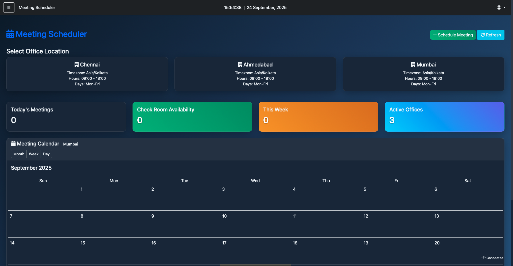

# Gate Pass Management System
## Overview

The **Gate Pass Management System (GPMS)** is a secure, web-based application developed to efficiently manage the entries and exits of visitors and employees within an organization.  
This system automates the gate pass issuance process, tracks visitor and employee movements, and generates comprehensive reports, making it an essential tool for organizational security and visitor management.  

With advanced features such as **admin/employee authentication, two-factor security, meeting scheduling, and a powerful admin dashboard**, GPMS not only strengthens access control but also enhances the overall efficiency of organizational workflows and real-time automation.

  

---

## Features

### Authentication & Security
- **Admin & Employee Sign In / Sign Up** – Dedicated authentication system for different roles with secure registration and login.

  

  

- **Two-Factor Authentication (2FA)** – Adds an extra layer of protection with OTP-based verification.
  
  

  

### Visitor Management
- **Visitor Entry & Registration** – Record visitor details including name, company, purpose of visit, entry/exit times, and vehicle information.  
- **Gate Pass Automation** – Simplifies issuance and tracking of visitor passes. - **Entry & Exit Tracking** – Real-time updates of all visitor movements.  

  

### Employee Tools
- **Local OD (Official Duty) Management** – Employees can apply for out-duty passes, specifying visit details, departure, and return times.  
- **Meeting Scheduler** – Schedule and manage meetings with employees and visitors seamlessly.

  

### Administrative Control
- **Admin Dashboard** – Centralized monitoring hub for visitor logs, OD requests, meetings, and overall activity.  
- **Data Export** – Export visitor, OD, and meeting records to Excel for reporting and analysis.  
- **Real-time Monitoring & Updates** – Continuously updated dashboards showing active visitors, employees, and system activities.

  

### User Experience
- **User-friendly Interface** – Clean and intuitive design for both admins and employees.  
- **Seamless Workflow** – Optimized for speed, accuracy, and ease of use across all devices.
- 
## 🛠️ Technologies Used

- **Backend**: ASP.NET MVC Framework, Entity Framework Core
- **Frontend**: HTML, CSS, JavaScript, Bootstrap
- **Database**: Microsoft SQL Server
- **Other Libraries**: EPPlus for Excel export functionality

## Usage

### Authentication & Security
- **Admin / Employee Sign In & Sign Up**  
  Secure login and registration for both employees and administrators.  
- **Two-Factor Authentication (2FA)**  
  Adds an extra layer of security using OTP verification.  

###  Visitor Management
- **Visitor Registration System**  
  Record visitor details including name, company, purpose of visit, and contact information.  
- **Entry & Exit Tracking**  
  Log visitor check-ins and check-outs along with vehicle details.  

###  Employee Tools
- **Local OD (Official Duty) Management**  
  Employees can apply for out-duty passes, providing location, purpose, departure, and return times.  
- **Meeting Scheduler**  
  Schedule, manage, and track meetings with visitors or employees.  

### Admin Dashboard
- **Centralized Monitoring**  
  Admins can view visitor statistics, OD requests, meeting schedules, and system activity in one place.  
- **Data Export**  
  Export visitor logs, OD records, and meeting schedules to Excel for reports and audits.  
- **Real-time Monitoring**  
  Track ongoing visits and active employees within the premises.  

### User Experience
- **User-friendly Interface**  
  Clean, intuitive design with easy navigation for both employees and administrators.  

## Screenshots

### Visitor Entry

